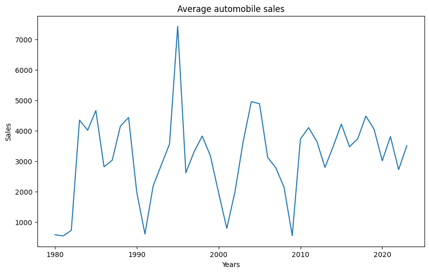
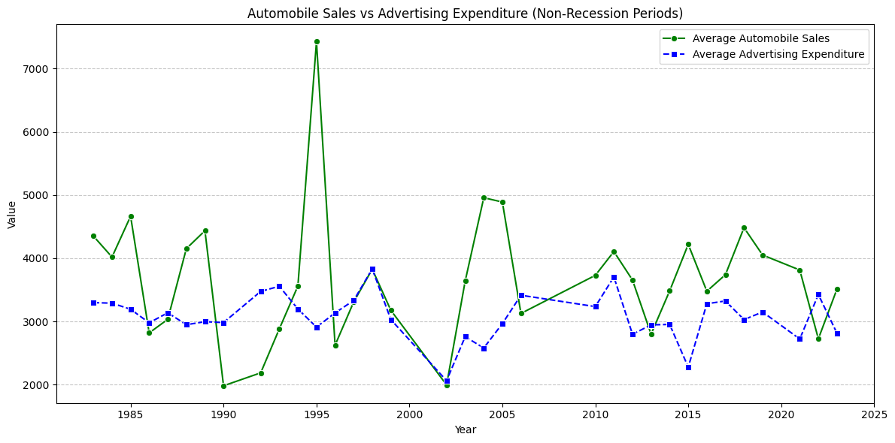
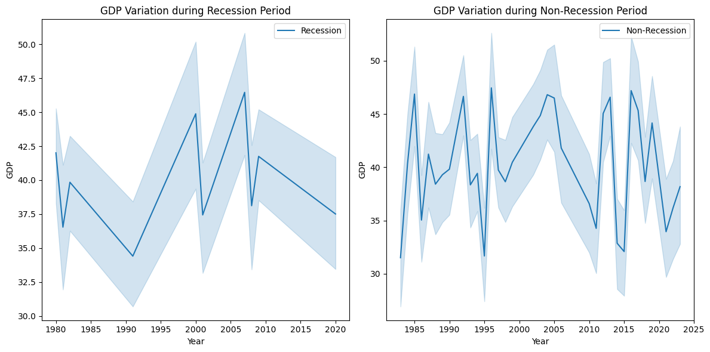
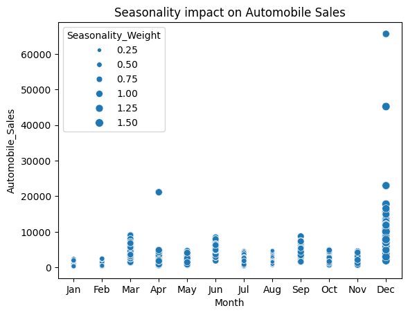
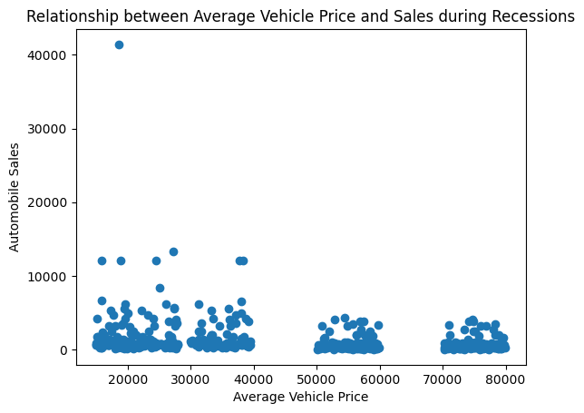
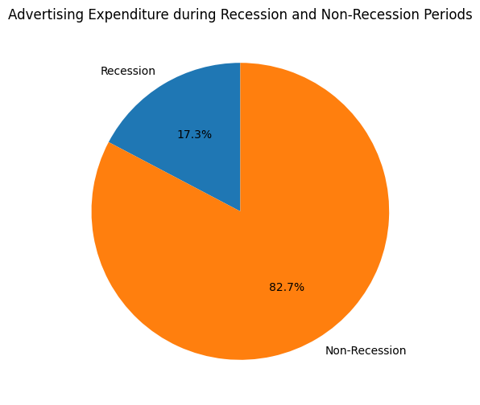
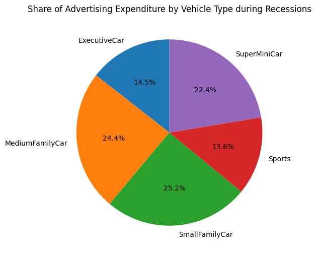
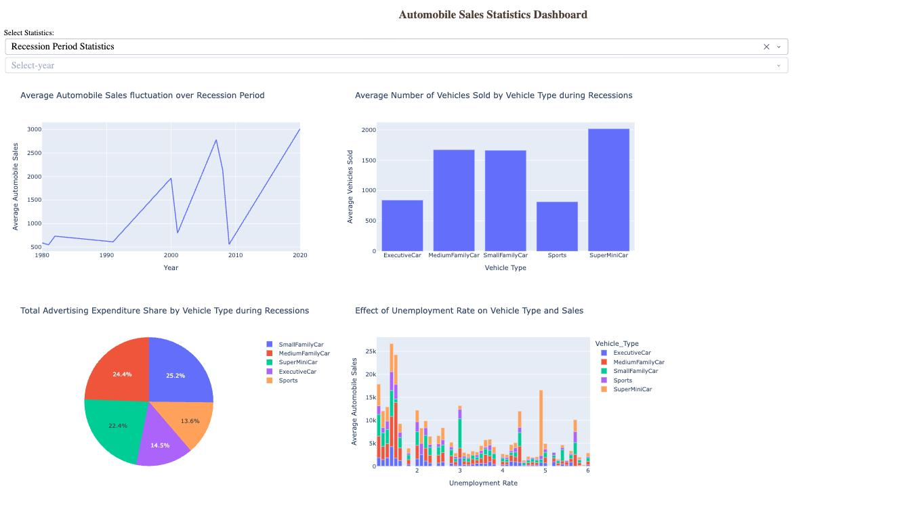
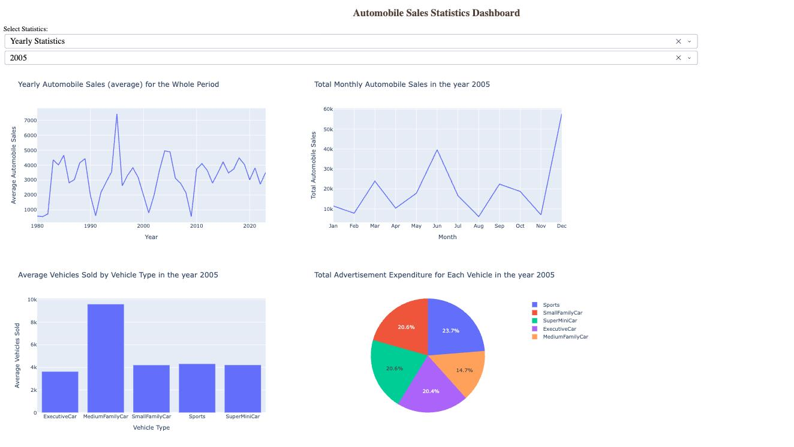

# Automobile Sales during Recessions – Python Visualizations & Plotly Dash Dashboard

Final assignment of **Course 8 – Data Visualization with Python**, part of the **IBM Data Analyst Professional Certificate** (Coursera).

**Scenario:** XYZAutomotives wants to understand how past recessions affected its automobile sales. The project explores 1980–2023 sales data with static charts (Matplotlib, Seaborn, pandas plotting), then turns the key views into an interactive **Plotly Dash** dashboard.

| Part | What | Tools | Output |
|---|---|---|---|
| Part 1 – Exploratory visualizations | 9 analysis tasks on sales, GDP, advertising, seasonality, price and consumer confidence | pandas, Matplotlib, Seaborn | Jupyter notebook with 10 charts |
| Part 2 – Interactive dashboard | Report selector (Recession / Yearly) + year selector, 4 charts per report | Plotly Dash, Plotly Express | Dash web app |

## Table of contents

- [Dataset](#dataset)
- [Repository structure](#repository-structure)
- [Part 1 – Exploratory visualizations](#part-1--exploratory-visualizations)
- [Part 2 – Interactive Dash dashboard](#part-2--interactive-dash-dashboard)
- [Key insights](#key-insights)
- [Skills demonstrated](#skills-demonstrated)
- [How to run](#how-to-run)
- [About the author](#about-the-author)
- [License](#license)

## Dataset

`automobile-sales.csv` (provided by IBM Skills Network, loaded directly from its public URL – no local copy needed):

- **2,112 monthly records**, **1980 → 2023**, **15 columns**.
- Main variables: `Date`, `Year`, `Month`, `Recession` (1/0), `Automobile_Sales`, `Vehicle_Type` (SuperMiniCar, SmallFamilyCar, MediumFamilyCar, ExecutiveCar, Sports), `Price`, `Advertising_Expenditure`, `GDP`, `unemployment_rate`, `Consumer_Confidence`, `Seasonality_Weight`, `Competition`, `Growth_Rate`, `City`.
- Recession periods covered: 1980, 1981–82, 1991, 2000–01, late 2007–mid 2009, Feb–Apr 2020 (COVID-19). About **22%** of the records fall in a recession.

## Repository structure

```
ibm-automobile-sales-dashboard/
├── notebooks/
│   └── automobile_sales_visualizations.ipynb   # Part 1 – tasks 1.1–1.9 with outputs
├── dashboard/
│   └── automobile_sales_dashboard.py           # Part 2 – Plotly Dash app
├── images/                                     # Charts and dashboard screenshots used in this README
├── requirements.txt
├── LICENSE
└── README.md
```

## Part 1 – Exploratory visualizations

Notebook: [`notebooks/automobile_sales_visualizations.ipynb`](notebooks/automobile_sales_visualizations.ipynb)

| Task | Question | Chart | Library |
|---|---|---|---|
| 1.1 | How do average sales change year by year? | Line chart with all years on the x-axis | pandas / Matplotlib |
| 1.2 | Do advertising and sales move together outside recessions? | Dual line chart | Seaborn |
| 1.3 | How much do sales drop in a recession? | Bar chart (recession vs non-recession) | Seaborn |
| 1.4 | How does GDP behave in each period? | Two line charts with subplots | Matplotlib + Seaborn |
| 1.5 | How does seasonality affect sales? | Bubble chart (size = seasonality weight) | Seaborn |
| 1.6 | Are sales linked to consumer confidence and price in recessions? | Two scatter plots | Matplotlib |
| 1.7 | How is advertising split between recession and normal periods? | Pie chart | Matplotlib |
| 1.8 | Which vehicle types get the ad budget during recessions? | Pie chart | Matplotlib |
| 1.9 | How does unemployment affect each vehicle type? | Line chart by vehicle type | Seaborn |

**Average sales over time** – the deepest dips line up with the recessions (1980–82, 1991, 2000–01, 2007–09):



**Advertising vs sales (non-recession years)** and **GDP in recession vs normal periods**:

| | |
|---|---|
|  |  |

**Seasonality** and **vehicle price vs sales during recessions**:

| | |
|---|---|
|  |  |

**Where the advertising budget goes:**

| | |
|---|---|
|  |  |

## Part 2 – Interactive Dash dashboard

Script: [`dashboard/automobile_sales_dashboard.py`](dashboard/automobile_sales_dashboard.py)

Two dropdowns control the page:

- **Select Statistics** – *Recession Period Statistics* or *Yearly Statistics*.
- **Select year** – enabled only for *Yearly Statistics* (a callback disables it for the recession report).

A second callback builds four Plotly charts in a 2 × 2 grid for the selected report.

| Recession Period Statistics | Yearly Statistics (e.g. 2005) |
|---|---|
| Average sales over recession years (line) | Average yearly sales, 1980–2023 (line) |
| Average vehicles sold by vehicle type (bar) | Total monthly sales in the selected year (line) |
| Advertising expenditure share by vehicle type (pie) | Average vehicles sold by vehicle type in that year (bar) |
| Effect of unemployment rate on vehicle type and sales (stacked bar) | Advertising expenditure by vehicle type in that year (pie) |

**Recession Period Statistics**



**Yearly Statistics – 2005**



## Key insights

- **Recessions cut sales sharply:** average monthly sales are about **3,700** vehicles in normal periods and about **1,400** in recessions, a drop of roughly **60%**. The lowest points of the yearly trend (≈ 550–800) are in 1980–82, 1991, 2001 and 2009.
- **Cheaper cars hold up better:** during recessions SuperMiniCar has the highest average sales (≈ 2,000), while ExecutiveCar and Sports fall to ≈ 800, less than half.
- **The ad budget follows the resilient segments:** in recessions **72%** of advertising goes to SmallFamilyCar (25.2%), MediumFamilyCar (24.4%) and SuperMiniCar (22.4%). ExecutiveCar and Sports get only 14.5% and 13.6%.
- **Advertising is cut in recessions:** 17.3% of total ad spend falls in recession periods, which is lower than their ≈ 22% share of the records.
- **Advertising does not drive sales on its own:** outside recessions, sales are much more volatile than ad spend (e.g. the 1995 peak of ≈ 7,400 with flat advertising). Demand is driven by other factors too.
- **Strong year-end seasonality:** December has by far the highest sales, with smaller peaks in March–April. In 2005, for example, monthly sales go from under 10k in the weakest months to ≈ 57k in December.
- **Price matters in a downturn:** during recessions most high-volume months are in the lower price bands (< $40k). Vehicles above $50k sell consistently less.

## Skills demonstrated

- **Data wrangling with pandas:** filtering (recession / non-recession), `groupby` + aggregations (`mean`, `sum`, named `agg`), reindexing months into calendar order.
- **Static visualization:** line, bar, scatter, bubble and pie charts; subplots; custom ticks, labels, legends and annotations (Matplotlib, Seaborn, pandas plotting).
- **Interactive dashboards:** Plotly Express charts, Dash layout (`html.Div`, `dcc.Dropdown`, `dcc.Graph`) and callbacks with multiple `Input`s.
- **Data storytelling:** choosing the right chart for each business question and turning charts into recommendations.

## How to run

```bash
git clone https://github.com/v-ambrosino/ibm-automobile-sales-dashboard.git
cd ibm-automobile-sales-dashboard
pip install -r requirements.txt

# Part 1 – notebook
jupyter lab notebooks/automobile_sales_visualizations.ipynb

# Part 2 – dashboard (then open http://127.0.0.1:8050 in the browser)
python dashboard/automobile_sales_dashboard.py
```

Both parts download the dataset from the IBM Skills Network URL, so an internet connection is required.

## About the author

**Vincenzo Ambrosino** – former IT lab teacher transitioning into Data Analytics.

- GitHub: [@v-ambrosino](https://github.com/v-ambrosino)
- LinkedIn: [vincenzo-ambrosino](https://www.linkedin.com/in/vincenzo-ambrosino)

## Acknowledgements

Dataset and assignment brief provided by **IBM Skills Network** as part of the IBM Data Analyst Professional Certificate.

## License

This project is released under the [MIT License](LICENSE).
